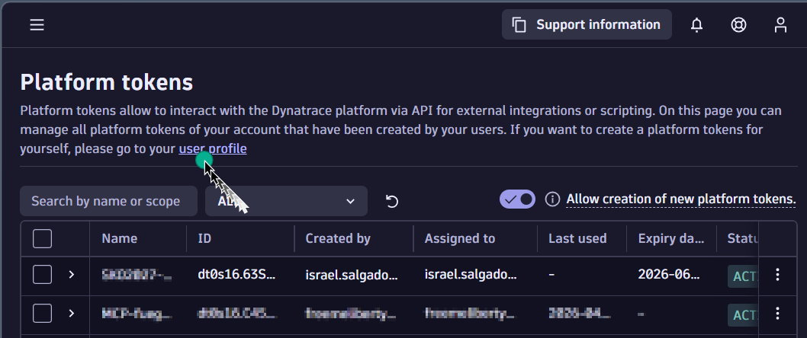
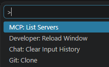
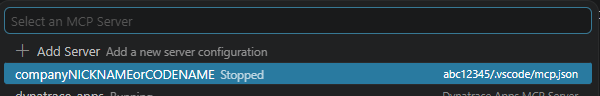
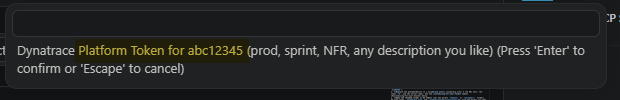
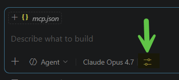
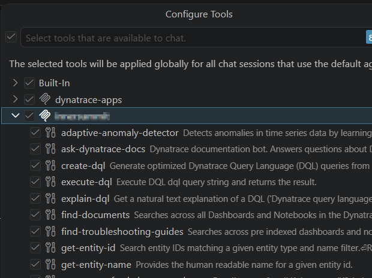
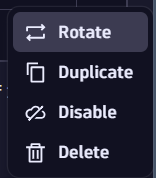
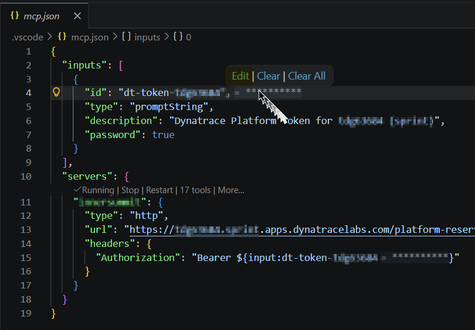

# Dynatrace Remote MCP Server: VS Code Setup

This workspace is configured to use the **official Dynatrace Remote MCP Server**, which runs inside your Dynatrace SaaS environment. There is no local Node.js process, no `npx` install, and no OAuth client to manage. VS Code connects directly to the MCP gateway over HTTPS using a Platform Token.

> Official references:
> - [Dynatrace Remote MCP Server documentation](https://docs.dynatrace.com/docs/dynatrace-intelligence/dynatrace-mcp)
> - [Migration guide: local → remote](https://github.com/dynatrace-oss/dynatrace-mcp/blob/main/docs/remote-mcp-migration.md)
> - [Dynatrace Hub listing](https://www.dynatrace.com/hub/detail/dynatrace-mcp-server/)

---

## How to use this template

This repository **is the per-tenant** template. Each Dynatrace tenant you work with gets its own copy of these files (the four under `.github/`, `.vscode/`, `README.md`, and `DTCTL-WITH-MCP.md`) so each VS Code workspace is fully self-contained, with its own `mcp.json`, its own token prompt, and its own auto-loaded agent briefing.

A suggested layout on your machine, especially if you handle more than one tenant:

```
<your-folder>/
└── Organizations/           ← partner picks the name (Tenants/, Customers/, Clients/)
    ├── Acme/
    │   ├── abc12345/        ← copy of this template (dt-remoteMCP), renamed to the tenant ID
    │   └── wxy98765/        ← another tenant for the same customer, another copy
    └── Globex/
        └── def67890/
```

### Per-tenant setup, in four steps

1. **Get a fresh copy of the template.** Either click **Use this template** on the GitHub repo (recommended; gives you a clean repo with no commit history), or copy this folder into `Tenants/<Customer>/<tenant-id>/`.
2. **Rename the folder** from `abc12345` to the real tenant ID (the 8-character ID, e.g. `wxy98765`).
3. **Replace the placeholders** in [.vscode/mcp.json](.vscode/mcp.json): the URL host, the input `id`, and the server label. See the [customizing-for-your-tenant table](#customizing-for-your-tenant) below.
4. **Open the renamed folder in VS Code** (the `abc12345` folder, not the parent `Organizations/` or `<Customer>/` folder). VS Code reads `.vscode/mcp.json` and `.github/copilot-instructions.md` from the folder you open. Opening a parent folder will **not** pick them up.

> Why one workspace per tenant? Each tenant needs its own MCP server URL and its own Platform Token. Keeping each in its own folder means VS Code never confuses them, and the auto-loaded agent briefing always points at the right environment.

---

## Prerequisites

- VS Code **1.102+** with GitHub Copilot Chat (MCP support enabled).
- Access to a Dynatrace SaaS environment (e.g. `https://abc12345.apps.dynatrace.com`).
  - Do **not** use Dynatrace classic URLs (`abc12345.live.dynatrace.com`).
- Permission in that environment to create a **Platform Token**.

---

## 1. Create a Platform Token

In your Dynatrace environment, go to **Account Management → Identity & access management → Platform tokens** (or follow the [Platform Tokens docs](https://docs.dynatrace.com/docs/manage/identity-access-management/access-tokens-and-oauth-clients/platform-tokens)).

> ⚠️ **You can't create a token from this page directly.** The Platform Tokens page lists tokens created by users in your account but does not have a "create token" button. To create a token for yourself, click the **user profile** link in the page description (highlighted below). That opens your personal profile, where the **Generate new token** action lives.
>
> 

### Required scopes

**Gateway (mandatory for the remote MCP server):**

- `mcp-gateway:servers:invoke`
- `mcp-gateway:servers:read`

**Tool-specific scopes** (add the ones you need; see [Server and server tools](https://docs.dynatrace.com/docs/dynatrace-intelligence/dynatrace-mcp#server) for the authoritative list):

- `app-engine:apps:run` (required by almost every tool)
- Grail data access (only what you need; see the [Grail permissions table](https://docs.dynatrace.com/docs/platform/grail/organize-data/assign-permissions-in-grail#grail-permissions-table)):
  - `storage:buckets:read`
  - `storage:logs:read`
  - `storage:events:read`
  - `storage:metrics:read`
  - `storage:spans:read`
  - `storage:entities:read`
  - `storage:bizevents:read`
  - `storage:security.events:read`
  - `storage:system:read`
- Davis analyzers: `davis:analyzers:read`, `davis:analyzers:execute`
- Davis Copilot: `davis-copilot:nl2dql:execute`, `davis-copilot:dql2nl:execute`, `davis-copilot:conversations:execute`
- Documents: `document:documents:read`

> _Scope lists last verified: 2026-05-07. The authoritative source is the [Server and server tools docs](https://docs.dynatrace.com/docs/dynatrace-intelligence/dynatrace-mcp#server). Check there if a tool reports a missing scope._

### Choosing write scopes carefully

The list above is **read-only**. The remote MCP server can also create or modify tenant objects (notebooks, dashboards, workflows, settings, custom events), but **only if you grant write scopes** when you create the token (e.g. `document:documents:write`, `automation:workflows:write`, `settings:objects:write`, `events:ingest`).

**Pick the minimum write scopes that match what you actually want the agent to do.** Start read-only (most troubleshooting and Q&A needs no writes), and add scopes only when you know you want the agent to author or modify objects. For anything beyond a quick edit, the `dtctl` apply/diff workflow gives you a local file you can review before anything hits the tenant; see [the dtctl section below](#optional-adding-dtctl-alongside-the-remote-mcp-server).

**Token scopes are the real safety boundary.** The agent's per-write echo block and live-state re-fetch (see [.github/copilot-instructions.md](.github/copilot-instructions.md)) are guardrails, but they only matter if the token has the scopes to write in the first place.

Copy the generated token (it looks like `dt0s16.ABC12345XYZ.••••••••`). You will paste it into VS Code on first use; it is **NOT** stored in this repository.

---

## 2. MCP configuration (already in this workspace)

The file `.vscode/mcp.json` is checked in and looks like this:

```json
{
  "inputs": [
    {
      "id": "dt-token-abc12345",
      "type": "promptString",
      "description": "Dynatrace Platform Token for abc12345",
      "password": true
    }
  ],
  "servers": {
    "CompanyName": {
      "type": "http",
      "url": "https://abc12345.apps.dynatrace.com/platform-reserved/mcp-gateway/v0.1/servers/dynatrace-mcp/mcp",
      "headers": {
        "Authorization": "Bearer ${input:dt-token-abc12345}"
      }
    }
  }
}
```

What this does:

- Declares an `inputs` entry so VS Code prompts for the token securely (stored in the OS secret store, never written to disk).
- Registers a **single** HTTP MCP server named `CompanyName` pointing at the gateway path **`/platform-reserved/mcp-gateway/v0.1/servers/dynatrace-mcp/mcp`** of your tenant.
- Injects the token into the `Authorization: Bearer …` header on every request.

### Customizing for your tenant

Replace these placeholders before using:

| Placeholder | Replace with | Example |
|---|---|---|
| `abc12345` (in `url` and `id`) | Your Dynatrace environment ID | `wxy98765` |
| `.apps.dynatrace.com` | Your environment domain | `.apps.dynatrace.com` for Prod. `.live.dynatrace.com` is **not** valid; use the `.apps.` host |
| `CompanyName` | A friendly server label shown in VS Code | `Acme-Prod` |

The placeholder `CompanyName` in the server label and the placeholder folder name `abc12345` in the workspace path are **arbitrary**. Pick whatever you like for the label, but use the real 8-character tenant ID for the folder.

---

## 3. Start the server in VS Code

1. Open this folder in VS Code.
2. Open the Command Palette → **MCP: List Servers** (or open `.vscode/mcp.json` and click the **Start** code-lens above the server entry).

   

   The server picker then shows the entry from `.vscode/mcp.json` (here named `companyNICKNAMEorCODENAME`, currently **Stopped**). Click it, then choose **Start Server**.

   

3. VS Code will prompt for the **Dynatrace Platform Token**. Paste the token from step 1. The token is stored in your OS secret store (Windows Credential Manager / macOS Keychain), keyed to the input `id` in `mcp.json`, so you won't be prompted again unless you run **MCP: Reset Cached Tokens** or change the input `id`.

   

4. Open Copilot Chat → switch to **Agent** mode → click the tools icon (next to the model name).

   

   You should see the Dynatrace tools listed under your server (e.g. `execute-dql`, `query-problems`, `get-vulnerabilities`, `ask-dynatrace-docs`, …).

   

---

## Rotating the Platform Token

When your token expires, gets revoked, or needs a scope change (e.g. switching from a read-only token to one that includes `document:documents:write`), follow this procedure. **Generate the new token first.** Once you start the edit flow in VS Code the cached value is gone, so have the replacement ready to paste.

1. **In Dynatrace:** go to **Account Management → Identity & access management → Platform tokens**, find your existing token, and click its actions menu → **Rotate** (or create a brand-new token if you also want to change the description / scopes).

   

   Copy the new token value. You won't see it again after closing the dialog.

2. **In VS Code:** open `.vscode/mcp.json`. Hover the cursor over the masked `**********` next to the `id` line. A small popup appears.

   

3. The popup exposes three actions: **Edit**, **Clear**, **Clear All**. Click **Edit** to update just this token, **Clear** to remove only this one (forces a fresh prompt next start), or **Clear All** to wipe every cached MCP secret on this machine. **Edit** is the recommended choice for a rotation.

4. After clicking **Edit**, an input field appears at the top of the VS Code window. It looks just like the [first-time token prompt](#3-start-the-server-in-vs-code) shown earlier, except now it's pre-populated with the cached token (still masked as `***...***`). **Delete the existing value, paste the new token from step 1, and press Enter.** VS Code re-encrypts and re-stores it under the same input `id`.

5. Restart the server (`.vscode/mcp.json` → the **Restart** code-lens, or **MCP: List Servers** → your server → **Restart**) so the new token is used on the next request.

> **Why the hover-and-edit flow rather than a Command Palette command?** VS Code has shipped several different command names over time for cached-token management (`MCP: Reset Cached Tokens`, etc.) and the exact name keeps drifting. The hover popup on the input `id` in `mcp.json` has been stable across versions and works without you needing to remember a command name.

---

## 4. Verify the connection

Try a simple prompt in Copilot Chat (Agent mode):

> Show me the last 10 error logs from the past hour.

or

> List the top 5 open problems.

Copilot will call the appropriate Dynatrace MCP tool and display the result.

---

## Troubleshooting

| Symptom | Likely cause / fix |
|---|---|
| `401 Unauthorized` | Token missing the gateway scopes (`mcp-gateway:servers:invoke`, `mcp-gateway:servers:read`) or expired. |
| `403 Forbidden` on a specific tool | Tool-specific scope missing (e.g. `storage:logs:read` for log queries). |
| Server shows as "stopped" / no tools listed | Check the URL host matches your tenant exactly and is the **`.apps.`** domain, not `.live.`. |
| Cannot find `MCP: List Servers` | Update VS Code to 1.102+ and ensure GitHub Copilot Chat is installed and signed in. |
| Token prompt never appears | Hover the masked `**********` next to the input `id` in `.vscode/mcp.json` and choose **Clear**, then restart the server. |

For deeper authentication debugging see the [authentication troubleshooting section](https://github.com/dynatrace-oss/dynatrace-mcp#authentication-issues) of the upstream project.

---

## Agent behavior

This workspace ships an auto-loaded Copilot Chat briefing at [.github/copilot-instructions.md](.github/copilot-instructions.md) that shapes how the agent behaves in this folder:

- Echoes the active MCP server on the first turn of every session.
- Uses clickable buttons (`vscode_askQuestions`) for any choice it asks you to make, including yes/no.
- Defaults all file operations to the workspace folder; reads outside require a stated reason, writes outside require explicit permission.
- Always starts Dynatrace investigations with problems before running broad log/DQL queries (Grail cost guard).
- Prints a single-line confirmation block before any MCP write (`create-*`, `update-*`, `send_*`).
- Re-fetches a resource's live state before modifying it.

A small set of safe terminal commands (`git status`, `git diff`, `git log`, `git branch`, `ConvertTo-Json`, `ConvertFrom-Json`) is pre-approved in [.vscode/settings.json](.vscode/settings.json) so the agent doesn't prompt for them every run.

---

## Security notes

- The Platform Token is sensitive; treat it like a password. Do **not** commit it; the `inputs` mechanism keeps it out of source control.
- Scope tokens to the minimum capabilities required for your use case.
- Querying Grail (`execute-dql`, etc.) may incur consumption charges. Start with small timeframes and specific buckets. See [Dynatrace pricing](https://www.dynatrace.com/pricing/).

---

## Optional: adding `dtctl` alongside the remote MCP server

[`dtctl`](https://github.com/dynatrace-oss/dtctl) is the official Dynatrace command-line tool. It runs in your terminal, authenticates against the same tenant, and adds capabilities the remote MCP server doesn't have on its own: declarative `apply` / `diff` / `history` / `restore` for notebooks, dashboards, and workflows; document `share` / `unshare`; richer output formats (`csv`, `yaml`, `wide`, table); and first-class scripting for CI.

The two tools are **complementary, not competing**. Many partners run both side by side and let the agent pick whichever fits the task.

> ### ⚠️ Read this before installing `dtctl` if you work with more than one tenant
>
> `dtctl`'s active context is **machine-global**, not per-workspace. Switching VS Code workspaces does **not** switch `dtctl`. That means:
>
> - A `dtctl apply` typed in the terminal of one workspace can silently hit a **different** tenant (whichever tenant you most recently `use-context`'d on this machine).
> - Commands like `dtctl config get-contexts` or `dtctl auth list-tokens` enumerate **every** tenant you've ever logged into, which is a real problem during a customer screen-share.
>
> Both failure modes are avoidable, but only if you know about them before you install. **Read [DTCTL-WITH-MCP.md](DTCTL-WITH-MCP.md), specifically the multi-tenant section at the top, before running `dtctl auth login`.**

For the full picture (capability comparison, install steps, safety levels, naming conventions, demo hygiene, common workflows, and the local scratch-folder pattern) see **[DTCTL-WITH-MCP.md](DTCTL-WITH-MCP.md)**.

The auto-loaded briefing at [.github/copilot-instructions.md](.github/copilot-instructions.md) tells Copilot Chat to prefer the MCP server for conversational/AI work, prefer `dtctl` for declarative apply/diff/share workflows, and follow your lead when both fit.
